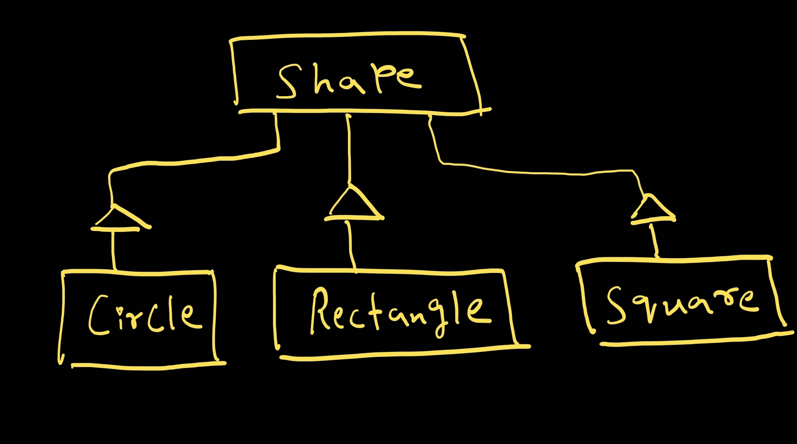

OpenForExtension Example

This project demonstrates the "Open For Extension" from the SOLID principles in object-oriented programming.
It uses an interface-based design to allow adding new shapes without modifying existing code,
keeping the system open for extension.

Even if we want to add another shape like a "triangle", we can just add a new "Triangle" class 
which would inherit from the "Shape" interface, and defined area calculation method.
Introduction of this new shape does not affect any of the other shape nor the main function.
It did not affect the area calculation at any point, none of code needs to be changed.